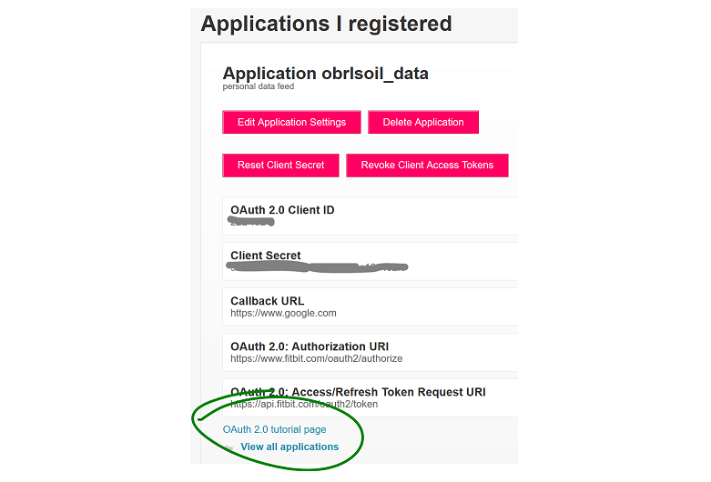

## fitbitViz

<br>

The **fitbitViz** R package allows the extraction of data and the
visualization of *‘ggplot2’*, *‘Leaflet’* and *3-dimensionsal
‘Rayshader’ Maps* using the [Fitbit Web
API](https://dev.fitbit.com/build/reference/web-api/). If you own any of
the **Fitbit activity trackers** you can take advantage of this package.

The 3-dimensional Rayshader Map requires the installation of the
[CopernicusDEM](https://github.com/mlampros/CopernicusDEM) R package
which includes the **30- and 90-meter elevation data**.

<br>

### **Requirements:**

To make use of this R package you have first to **register an
Application** in <https://dev.fitbit.com/>. By registering an
application you will receive the Fitbit **token** which besides your
existing
[user-id](https://community.fitbit.com/t5/Web-API-Development/Where-do-I-find-my-User-ID/m-p/1138667/highlight/true#M4375)
is required so that you can take advantage of the **fitbitViz**
functions.

There are many resources on the web on how to setup a Fitbit
application. I modified the following
[guide](https://obrl-soil.github.io/fitbit-api-r/) which explains in
detail how to register an application and then receive a token to
retrieve the Fitbit data for a specific time period (maximum a year).
The next images and comments explain the whole process,

-   Go to <https://dev.fitbit.com/> and click on **Manage &gt; Register
    an App**

    **Login with your Fitbit credentials** and follow the prompts. I
    used as URL in the Registration Page **my Fitbit user-id** url,
    **`https://www.fitbit.com/user/USER_ID`**. You have to replace the
    **USER\_ID** in the url with [your specific
    user-id](https://community.fitbit.com/t5/Web-API-Development/Where-do-I-find-my-User-ID/m-p/1138667/highlight/true#M4375).
    Then in the **Redirect URL** field use **`https://localhost`**. Tick
    the remaining options as in the next image, *read and agree to the
    terms of service* and click **Register** to register the
    application.

    

-   Once the app is created, click on the ‘OAuth 2.0 tutorial page’
    weblink near the bottom of the screen:

    

-   Scroll down to the end of **1. Authorize** and **right click** on
    the provided **authorization URL** (in blue color) to open this URL
    on a new web browser tab which will show the Fitbit authorization
    interface. Change the auth period to **1 year** so that you don’t
    have to go through this too often and tick all options before
    clicking *Allow* (you will probably play with the other endpoints at
    some point in the future)

    

-   After clicking *Allow*, the browser tab redirects to the callback
    URL. You’ll have to **copy and paste the full URL** which now
    includes also the **access token** to the **2. Parse response**
    header of the previous tab (where we have seen also the *1.
    Authorize* section). The required **access token** for your
    application that you can use in this package will appear below the
    text box (it’s a long string of characters).

<br>

To install the package from CRAN use,

``` r
install.packages("fitbitViz")
```

<br>

and to download the latest version of the package from Github,

``` r
remotes::install_github('mlampros/fitbitViz')
```

<br>

-   **References**:
    -   <https://dev.fitbit.com/build/reference/web-api/>
    -   <https://obrl-soil.github.io/fitbit-api-r/>
    -   <https://registry.opendata.aws/copernicus-dem/>
    -   <https://copernicus-dem-30m.s3.amazonaws.com/readme.html>

<br>
